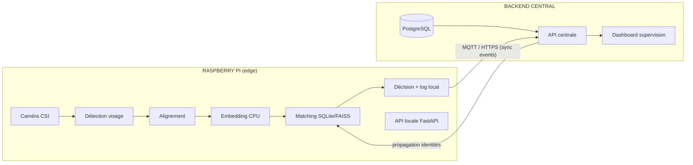

# Face Recognition IoT — Système de reconnaissance faciale multi-sites

Système de reconnaissance faciale edge, déployé sur Raspberry Pi (module caméra CSI), avec traitement temps réel en local (CPU) et supervision centralisée multi-sites via un backend PostgreSQL.

## Architecture (vue d'ensemble)

**Principe clé** : chaque Raspberry Pi fonctionne de façon autonome (base locale SQLite, décision locale, aucune dépendance réseau pour reconnaître un visage). Le backend central sert à la supervision, l'audit et la propagation des identités entre sites — jamais au traitement temps réel.

## Stack technique

| Brique                    | Choix                      | Justification résumée                                             |
|---------------------------|----------------------------|-------------------------------------------------------------------|
| Détection de visage       | YuNet (OpenCV)             | Léger, natif OpenCV, bon compromis précision/vitesse sur CPU ARM  |
| Extraction d'embedding    | MobileFaceNet              | Précision proche d'ArcFace classique pour un poids ~4 Mo          |
| Moteur d'inférence        | TensorFlow Lite            | Support natif ARM64, quantification INT8                          |
| Recherche vectorielle     | FAISS (CPU)                | Suffisant en local, pas de serveur vector DB nécessaire sur le Pi |
| Stockage edge             | SQLite (chiffré)           | Zéro dépendance serveur, fonctionnement hors-ligne                |
| Stockage central          | PostgreSQL                 | Multi-sites, requêtes relationnelles, supervision                 |
| API edge                  | FastAPI                    | Léger, async, documentation OpenAPI automatique                   |
| Messagerie événementielle | MQTT                       | Standard IoT, léger, adapté au temps réel                         |
| CI/CD                     | Jenkins                    | Pipelines séparés edge (ARM64) / backend (x86_64)                 |
| Conteneurisation          | Docker (buildx multi-arch) | Reproductibilité, portabilité                                     |

## Conventions de nommage

- Fichiers Python : `snake_case.py`
- Classes : `PascalCase`
- Fonctions/variables : `snake_case`
- Constantes : `UPPER_SNAKE_CASE`
- Branches Git : `feature/epic-<n>-<description-courte>`
- Commits : [Conventional Commits](https://www.conventionalcommits.org/) (`feat:`, `fix:`, `docs:`, `test:`, `chore:`)

## Méthodologie

Développement Agile/Scrum, sprints de 2 semaines, découpage Epic → User Story → tâche technique.

## État du projet

En cours de développement — Setup initial.