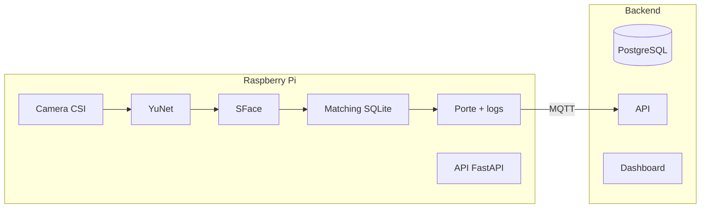

# Face Recognition IoT

Reconnaissance faciale sur Raspberry Pi (camera CSI), decision locale, dashboard de supervision.

## Production

Modele : YuNet (detection) + SFace (embedding 128-d). Un seul seuil cosinus et une marge 1er/2e score. Enrolement : une photo sans masque. Vivacite par parallaxe activee.

Ne pas remplacer SFace par un autre embedder. Ne pas utiliser de classificateur de masque pour changer de seuil.

Commandes (`make help` pour la liste) :

```bash
make test
make run-pi          # Pi : conteneur + volume (garde la base)
make stop            # avant capture CSI / reset
make start
make capture         # photos genuine + imposteurs (webcam ; sur Pi: CSI liberee)
make calibrate-docker
make reset-db-docker # site vide, puis reenrôler
```

Sur le Pi, une fois le service allume : enrôler via `http://<ip>:8000` (1 photo sans masque), arreter l'API, prendre les JPEG de calibration avec la CSI, `make calibrate-docker`, verifier un autorise et un inconnu.

La porte est stricte : un inconnu ne doit pas passer. Un autorise (surtout masque) peut etre refuse. Pas de cible 99 % d'acceptation.

## Architecture


```mermaid
flowchart LR
    subgraph EDGE["Raspberry Pi"]
        A[Camera CSI] --> B[YuNet]
        B --> C[SFace]
        C --> D[Matching SQLite]
        D --> E[Porte + logs]
        F[API FastAPI]
    end
    subgraph CENTRAL["Backend"]
        H[(PostgreSQL)]
        I[API]
        J[Dashboard]
    end
    E -- MQTT --> I
```

Chaque Pi reconnait hors-ligne (SQLite). Le backend sert l'audit et, plus tard, plusieurs sites.

## Stack

| Brique | Choix |
|---|---|
| Detection | YuNet (OpenCV) |
| Embedding | SFace 128-d (OpenCV Zoo) |
| Stockage edge | SQLite, embeddings chiffres |
| API | FastAPI |
| Dashboard | Next.js (export statique servi par FastAPI) |

## Nommage

Fichiers Python : `snake_case.py`. Classes : `PascalCase`. Commits : Conventional Commits.
