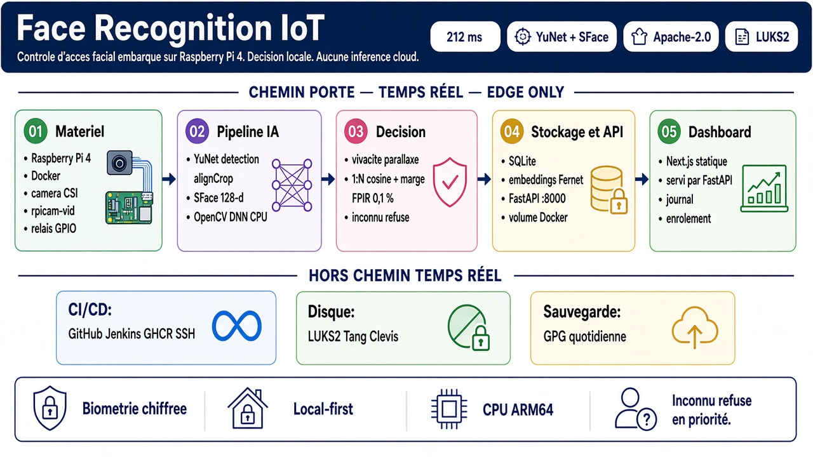
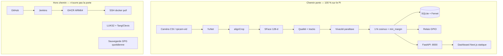

# Face Recognition IoT

Contrôle d’accès par reconnaissance faciale **sur Raspberry Pi 4**. La décision d’ouvrir la porte est locale : caméra CSI, modèles OpenCV, SQLite chiffré, FastAPI et dashboard sur le même hôte. Aucune inférence cloud.



<p align="center"><em>Chemin porte (01–05) vs opérations hors temps réel (CI/CD, LUKS, sauvegarde).</em></p>

## Principe

La porte est **stricte**. Un inconnu ne doit pas passer (cible FPIR 0,1 % après calibration sur le site). Un autorisé, surtout masqué, peut être refusé. Il n’y a pas d’objectif « 99 % d’acceptation ».

| Décision | Règle |
|---|---|
| Ouvrir | meilleur score ≥ seuil **et** (1er − 2e) ≥ `min_margin` **et** vivacité parallaxe OK |
| Refuser | le reste, y compris photo d’un enrôlé tenue devant la caméra |
| Enrôlement | **une** photo nette, **sans masque** |
| Modèles | YuNet (détection) + SFace 128-d (`alignCrop`) — OpenCV Zoo, Apache-2.0 |

Ne pas remplacer SFace. Ne pas introduire de classificateur de masque ni de second seuil.

## Architecture

Le schéma ci-dessus est la source de vérité produit. Le diagramme suivant reprend le même découpage.


```mermaid
flowchart TB
  subgraph runtime["Chemin porte — 100 % sur le Pi"]
    CSI[Caméra CSI / rpicam-vid] --> YN[YuNet]
    YN --> AC[alignCrop]
    AC --> SF[SFace 128-d]
    SF --> Q[Qualité + tracks]
    Q --> LV[Vivacité parallaxe]
    LV --> MT[1:N cosinus + min_margin]
    MT --> SQL[(SQLite + Fernet)]
    MT --> GPIO[Relais GPIO]
    MT --> API[FastAPI :8000]
    API --> UI[Dashboard Next.js statique]
  end

  subgraph ops["Hors chemin — n’ouvre pas la porte"]
    GH[GitHub] --> JK[Jenkins]
    JK --> REG[GHCR ARM64]
    REG --> SSH[SSH docker pull]
    DISK[LUKS2 + Tang/Clevis]
    BAK[Sauvegarde GPG quotidienne]
  end
```

**Hors périmètre actuel** : backend central PostgreSQL, MQTT obligatoire, FAISS, ONNX Runtime, fine-tune Kaggle / GPU. MQTT existe dans le code mais reste optionnel (dashboard = surface de supervision).

### Chemin temps réel

1. **Matériel** — Raspberry Pi 4 64-bit, Docker `--privileged` + `/run/udev`, caméra CSI en flux `rpicam-vid` (pas un still par frame), relais GPIO.
2. **Pipeline IA** — YuNet → `FaceRecognizerSF.alignCrop()` → SFace 128-d via OpenCV DNN CPU. Latence mesurée ~212 ms une fois le flux continu en place (capture still ~1,2 s écartée).
3. **Décision** — filtre qualité, suivi multi-visages, anti-spoofing par parallaxe, matching brute-force 1:N, un seuil + marge. Calibration `TARGET_FPIR = 0.001` sur JPEGs du **site**.
4. **Stockage / API** — embeddings chiffrés Fernet dans SQLite (`storage_data/`, volume `face-recognition-data`). FastAPI, `X-API-Key` sur les routes sensibles, `/health` public.
5. **Dashboard** — Next.js exporté en statique, servi par FastAPI (même origine) : flux, décision vert/rouge, enrôlement, identités, journal.

### Hors chemin

| Brique | Rôle |
|---|---|
| Jenkins | pytest → `docker buildx` linux/arm64 → push GHCR → SSH `docker pull` + recréation du conteneur |
| LUKS2 + Tang/Clevis | disque root chiffré, déverrouillage réseau (NBDE) |
| Sauvegarde | export volume + GPG ; le Mac initie SSH sortant ; pas d’entrée exposée sur le Mac |

Un `git push` ne met **pas** à jour l’UI du Pi tant que le job Jenkins n’a pas déployé une nouvelle image. Le dashboard est cuit dans l’image (`dashboard/out` → `/app/dashboard_static`).

## Pile

| Couche | Choix | Pourquoi |
|---|---|---|
| Détection | YuNet | OpenCV embarqué, CPU ARM |
| Embedding | SFace 128-d | même zoo, Apache-2.0 ; InsightFace écarté (licence recherche) |
| Inférence | OpenCV DNN | pas d’ONNX Runtime / TFLite |
| Matching | numpy, 1:N | volume local ; pas de serveur vecteur |
| Données | SQLite + Fernet | autonome hors-ligne |
| API | FastAPI | enrôlement, logs, stats, flux |
| UI | Next.js static export | un seul processus, un seul port 8000 |
| Conteneur | `python:3.11-slim-trixie` ARM64 | CSI + libcamera |
| Persistance | volume `face-recognition-data` | survit aux redéploiements |

## Exploitation

```bash
make help
make test
make run-pi              # Pi : conteneur + volume (garde identités et seuils)
make stop                # avant capture CSI / reset
make start
make capture             # genuine + imposteurs (webcam ; sur Pi : CSI libérée)
make calibrate-docker
make reset-db-docker     # site vide, puis réenrôler
```

Après un service allumé : enrôler via `http://<ip>:8000` (1 photo sans masque) → arrêter l’API → capturer les JPEG de calibration avec la CSI → `make calibrate-docker` → tester un autorisé et un inconnu.

Les seuils LFW / notebook ne s’appliquent pas à une porte réelle. Sans `thresholds.json` sur le volume, le matcher utilise un repli (seuil 0,5) : calibrer **sur la caméra du site**.

Ne pas faire `docker rm` à la main si le volume doit rester. `make stop` n’arrête que le Docker de **cette** machine (Mac ≠ Pi).

## Sécurité (rappel)

- Embeddings chiffrés au repos ; pas d’images brutes conservées après extraction.
- Clé API injectée par Jenkins, jamais commitée.
- Purge des logs d’accès (90 jours).
- Reconnaissance sans Internet (testé avec route coupée) ; Tailscale / GHCR / Tang concernent l’admin et le boot, pas le matching.
- Cadre biométrie : voir `docs/aipd.md` (brouillon, pas un avis juridique).

## Dépôt

| Chemin | Contenu |
|---|---|
| `edge/` | pipeline, API, scripts, Dockerfile |
| `dashboard/` | UI Next.js |
| `infra/jenkins/` | pipeline GHCR + SSH Pi |
| `infra/disk-encryption/` | LUKS / post-flash |
| `docs/` | architecture, AIPD, visuels |

Nommage : Python `snake_case`, classes `PascalCase`, commits Conventional Commits.
