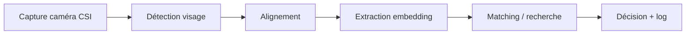

# Architecture technique — Face Recognition IoT

## 1. Pipeline fonctionnel (edge)

Chaque étape est un module Python indépendant dans `edge/src/`, testable isolément.

## 2. Décisions techniques et justifications

### Détection de visage — YuNet (OpenCV)
Alternative écartée : MTCNN, RetinaFace (trop lourds pour CPU ARM sans accélération matérielle).
YuNet est intégré nativement à OpenCV ≥ 4.5.4, quantifié, pensé pour l'embarqué.

### Extraction d'embedding — SFace (OpenCV Zoo)
Alternative écartée : MobileFaceNet via InsightFace (licence recherche non-commerciale
uniquement, incompatible avec un usage professionnel/commercial).
SFace provient du même dépôt officiel qu'YuNet (OpenCV Zoo), licence Apache-2.0
permissive, et est nativement supporté par OpenCV via `cv2.FaceRecognizerSF` —
conçu par l'équipe OpenCV pour fonctionner directement avec YuNet.

### Alignement pour l'embedding — `cv2.FaceRecognizerSF.alignCrop()`
Le module maison `edge/src/recognition/face_aligner.py` (Story 2.2) utilise des
positions de référence génériques de type ArcFace/InsightFace, adaptées à
MobileFaceNet — pas garanties compatibles avec le préprocessing attendu par SFace.
Pour l'extraction d'embedding réelle, on utilise donc `alignCrop()`, natif à
`FaceRecognizerSF`, qui garantit un alignement exactement conforme à
l'entraînement du modèle. `face_aligner.py` est conservé comme utilitaire
générique et réutilisable (déjà testé visuellement), au cas où un autre modèle
d'embedding serait adopté plus tard.

### Moteur d'inférence — TensorFlow Lite / OpenCV DNN
Pour YuNet et SFace, l'inférence passe directement par le module DNN natif
d'OpenCV (`cv2.FaceDetectorYN`, `cv2.FaceRecognizerSF`) — pas besoin de
TensorFlow Lite ou ONNX Runtime séparés pour ces deux modèles spécifiquement.
TensorFlow Lite reste l'option de référence si un futur modèle (ex: modèle de
classification additionnel) nécessite un moteur d'inférence dédié.

### Stockage edge — SQLite (chiffré)
Alternative écartée : PostgreSQL en local sur le Pi (inutile : consomme des
ressources pour rien sur un device à ressources limitées, sans bénéfice
puisque le Pi fonctionne en autonome).
SQLite = zéro dépendance serveur, fonctionnement garanti hors-ligne.

### Stockage central — PostgreSQL
Utilisé uniquement côté backend (serveur), pour la supervision multi-sites :
requêtes relationnelles complexes, gestion de la concurrence multi-Pi, reporting.

### Recherche vectorielle — FAISS (mode CPU)
Alternative écartée : vector DB serveur (Milvus, Qdrant) — trop lourd pour un
device isolé. FAISS tourne en mémoire locale, suffisant jusqu'à plusieurs
milliers d'identités enrôlées.

## 3. Séparation edge / backend

| Aspect | Edge (Raspberry Pi) | Backend central |
|---|---|---|
| Architecture matérielle | ARM64 | x86_64 |
| Rôle | Traitement temps réel, décision locale | Supervision, audit, propagation identités |
| Dépendance réseau | Aucune pour fonctionner | Requise pour la synchronisation |
| Base de données | SQLite (locale, chiffrée) | PostgreSQL |
| Déploiement | Image Docker ARM64 via Jenkins + Ansible | Image Docker x86_64 via Jenkins |

## 4. Sécurité (rappel des principes, détaillés en Epic 9)

- Embeddings biométriques chiffrés au repos (edge et central)
- Pas de stockage d'images brutes après extraction de l'embedding
- Communications Pi ↔ backend chiffrées (TLS)
- Purge automatique des données selon politique de rétention définie (AIPD)

## 5. Historique des décisions

| Date | Décision | Raison |
|---|---|---|
| Sprint 0 | Architecture multi-sites confirmée | Besoin de supervision centralisée sur plusieurs Raspberry Pi |
| Sprint 0 | Caméra CSI officielle retenue (pas USB) | Meilleure intégration matérielle native au Pi |
| Sprint 0 | Inférence CPU pur pour la V1 | Pas de budget accélérateur matériel au démarrage ; benchmark prévu en Epic 6.2 avant décision finale |
| Sprint 3-4 | Seuil de netteté (QualityFilter) fixé à 5.0 sur webcam Mac | Valeur empirique mesurée en conditions réelles (webcam laptop compressée) ; à recalibrer sur caméra CSI Pi en Story 1.4, capteur/pipeline différents |
| Sprint 5-6 | Léger tremblement visuel du crop aligné accepté sans lissage temporel | Sans impact sur la qualité d'embedding (extraction frame par frame indépendante) ; lissage temporel des landmarks noté comme amélioration facultative future |
| Sprint 5-6 | MobileFaceNet (InsightFace) écarté, SFace adopté | Licence InsightFace = recherche non-commerciale uniquement (bloquant pour usage professionnel). SFace = même dépôt officiel qu'YuNet (OpenCV Zoo), licence Apache-2.0 permissive |
| Sprint 5-6 | Alignement pour l'embedding via `cv2.FaceRecognizerSF.alignCrop()` natif, pas via `FaceAligner` maison | Garantit la compatibilité exacte avec le préprocessing attendu par SFace ; `FaceAligner` conservé comme utilitaire générique réutilisable |
| Sprint 5-6 | Validation empirique SFace : score ~0.8-1.0 même personne, ~0.2-0.6 personnes différentes (webcam Mac) | Bonne séparation, confirme la fiabilité du modèle ; seuil de décision définitif à calibrer rigoureusement en Story 4.3 avec un vrai jeu de test |
| Sprint 9 | Connexion SQLite partagée protégée par threading.Lock dans l'API | FastAPI exécute chaque requête dans un thread du pool ; SQLite refuse par défaut le partage inter-thread d'une connexion. Solution pragmatique adaptée au faible volume edge ; une architecture haute-concurrence utiliserait plutôt un pool de connexions |
| Sprint 10 | Pipeline Jenkins fonctionnel : Docker agent (python:3.11-slim-bookworm), 12 tests automatisés passent | Jenkins existant réutilisé (multi-projets) ; job dédié `face-recognition-iot` créé ; correction format version opencv-python (5.0.0 -> 5.0.0.93) |
| Sprint 11-12 | Support caméra CSI Pi via rpicam-still (subprocess) plutôt que picamera2 | picamera2 est lié à la version Python système du Pi (3.13), incompatible avec notre 3.11.9 (pyenv) utilisé sur tout le projet. Un exécutable externe appelé en sous-processus n'a aucune dépendance à la version Python appelante. Compromis : léger overhead de warm-up par capture, à mesurer en Story 1.4 |
| Sprint 11-12 | Benchmark Pi réel (Story 1.4) : capture rpicam-still ~1065ms, détection YuNet ~76ms, filtre qualité <1ms, embedding SFace ~67ms — total ~1200ms | Capture domine à 88% du temps total, mesure stable sur 2 runs (écart <1%). Latence totale > objectif initial (<500ms) posé en Sprint 0. Optimisation nécessaire avant mise en production réelle |
| Sprint 11-12 | Capture Pi optimisée : rpicam-vid en flux continu (thread arrière-plan) remplace rpicam-still par-frame | Latence capture réduite de ~1069ms à ~0.4ms (gain ~2600x). Pipeline total : ~1213ms -> ~212ms, sous l'objectif de 500ms fixé en Sprint 0 |
| Sprint 11-12 | Story 6.1 validée : 1664 cycles pipeline complet en 5 min, 0 erreur, température 39-51°C, RAM ~700MB | Stabilité confirmée sur test court. Test de longue durée (24h) recommandé avant mise en production réelle, mais résultats initiaux très sains |
| Sprint 11-12 | Story 6.2 (accélérateur Coral/Hailo) marquée non nécessaire | Latence CPU pur mesurée à ~212ms (Story 1.4/2.5), largement sous l'objectif de 500ms fixé en Sprint 0. Test de charge (Story 6.1) confirme la stabilité sans erreur sur 1664 cycles. Aucun besoin démontré justifiant l'investissement matériel et la complexité de conversion de modèles |
| Sprint 11-12 | Story 6.3 validée via Docker (`--restart unless-stopped`) plutôt que systemd | Approche pivot vers conteneurisation complète (suite à question légitime sur l'architecture de déploiement). Docker gère nativement le redémarrage auto sur crash réel (testé via SIGKILL interne), contrairement à un arrêt volontaire (docker stop/kill externe) qui n'en déclenche pas |
| Sprint 11-12 | EventPublisher rendu résilient : connexion MQTT échouée ne bloque plus le démarrage de l'API (try/except au lieu de crash) | Révélé par le crash-loop systemd puis Docker sur Pi sans Mosquitto installé localement ; bonne pratique de résilience générale, pas juste un correctif ponctuel |
| Sprint 11-12 | Conteneurisation Docker validée avec accès caméra CSI complet | Investigation en 6 étapes : (1) image Bookworm incompatible avec dépôt Raspberry Pi (paquets Trixie) -> bascule vers `python:3.11-slim-trixie` ; (2) clé de signature copiée depuis l'hôte plutôt que retéléchargée ; (3) `/proc/device-tree` invisible en conteneur -> nécessite `--privileged` ; (4) périphériques `/dev/video*`, `/dev/media*`, I2C, vchiq tous accessibles via `--privileged` seul (monte le `/dev` complet de l'hôte) ; (5) caméra toujours non détectée malgré accès matériel complet ; (6) cause réelle : udev (`/run/udev`) non partagé — libcamera ne peut identifier les device nodes comme caméras sans cette base. Solution finale : `--privileged` + `-v /run/udev:/run/udev:ro` |
| Sprint 11-12 | Pipeline Docker validé techniquement (capture, transmission HTTP, détection, réponse structurée) | Test `/enroll` avec visage réel non encore effectué (déplacement, personne devant caméra) — à confirmer dès que possible. Comportement observé cohérent avec les tests pré-Docker (rejet correct sans visage) |
| Sprint 11-12 | Story 6.4 validée : API reste fonctionnelle sans accès Internet (test réel avec coupure de route par défaut, restauration automatique) | Confirme l'architecture "autonome" posée en Sprint 0 : SQLite local, aucune dépendance cloud pendant la reconnaissance. Test sécurisé via script auto-réversible pour ne pas perdre l'accès SSH (Tailscale nécessite Internet pour ce Pi distant) |
| Sprint 13-14 | Story 8.5 (partie 1) : Jenkins pousse automatiquement l'image ARM64 vers GitHub Container Registry après chaque build réussi | Authentification via credential Jenkins dédié (`ghcr-credentials`), jamais exposé en clair. Image versionnée par BUILD_NUMBER + tag latest |
| Sprint 13-14 | Story 8.5 complète : pipeline CI/CD entièrement automatisé (tests → build ARM64 → push GHCR → déploiement SSH → conteneur relancé sur le Pi) | Correction finale : modèles ONNX (gitignorés) doivent être téléchargés pendant le build Docker, pas copiés depuis le contexte local — sinon l'image construite par Jenkins n'a pas accès aux fichiers du Pi |
| Sprint 13-14 | Validation finale post-déploiement : détection échoue à pleine résolution (2592x1944) mais réussit à 640x480 | YuNet mal adapté aux très hautes résolutions avec notre configuration actuelle. Notre code de production (Camera, défaut 640x480) n'est pas affecté — le souci ne touchait que les commandes de test manuel `rpicam-still` sans `--width/--height` explicites. Test final réussi : enroll + verify, confidence=1.0 |
| Sprint 15 | Authentification API par clé statique (header X-API-Key) ajoutée suite à l'AIPD | Endpoints sensibles (/enroll, /verify, /logs) protégés ; /health reste public pour supervision externe. Clé injectée via Jenkins Credentials, jamais commitée. Comparaison en temps constant (secrets.compare_digest) pour éviter les attaques par timing |
| Sprint 15 | Volume Docker persistant (`face-recognition-data`) ajouté pour `storage_data/` | Sans ce volume, chaque redéploiement recréait une base SQLite vide, effaçant silencieusement toutes les identités enrôlées. Validé par test réel : enrôlement → redéploiement complet → vérification réussie sans réenrôlement (confidence=1.0) |
| Sprint 15 | Story 9.1 : purge automatique des logs d'accès (90 jours, tâche de fond quotidienne) + endpoint manuel `/admin/purge-logs` pour tests | Validé : purge s'exécute sans erreur (0 log à purger, cohérent avec des logs récents), persistance des identités confirmée après déploiement avec cette nouvelle fonctionnalité |
| Sprint 15 | Serveur Tang installé sur Mac (Docker, padhihomelab/tang, port 7500) en préparation du chiffrement LUKS/NBDE du Pi | Empreintes récupérées : Ad034bexxxxs (verify), xx0CexxxxR (deriveKey). Conversion LUKS elle-même reportée à une session dédiée — opération techniquement délicate nécessitant vérification étape par étape |
